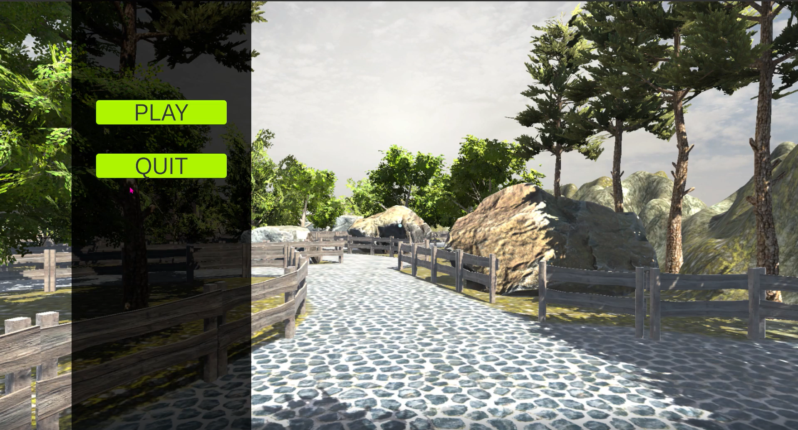
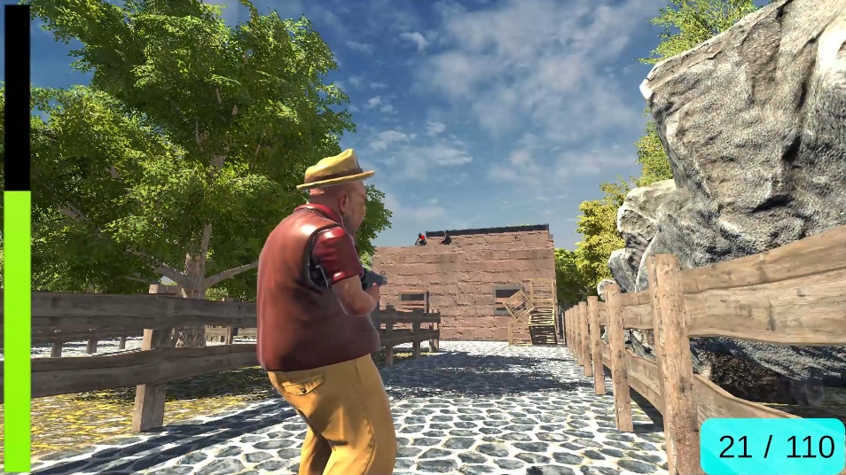
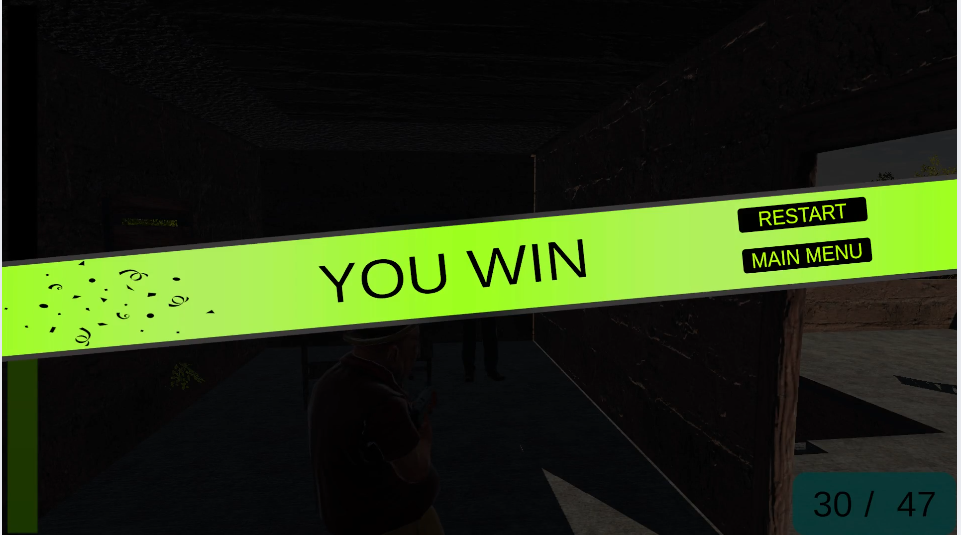
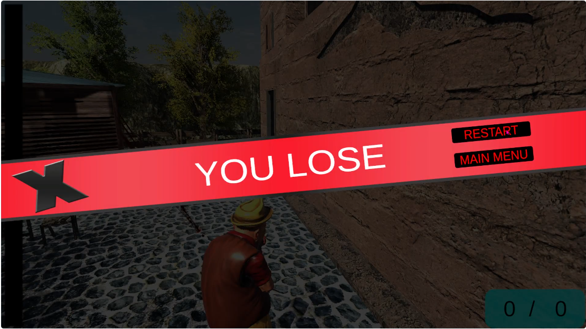
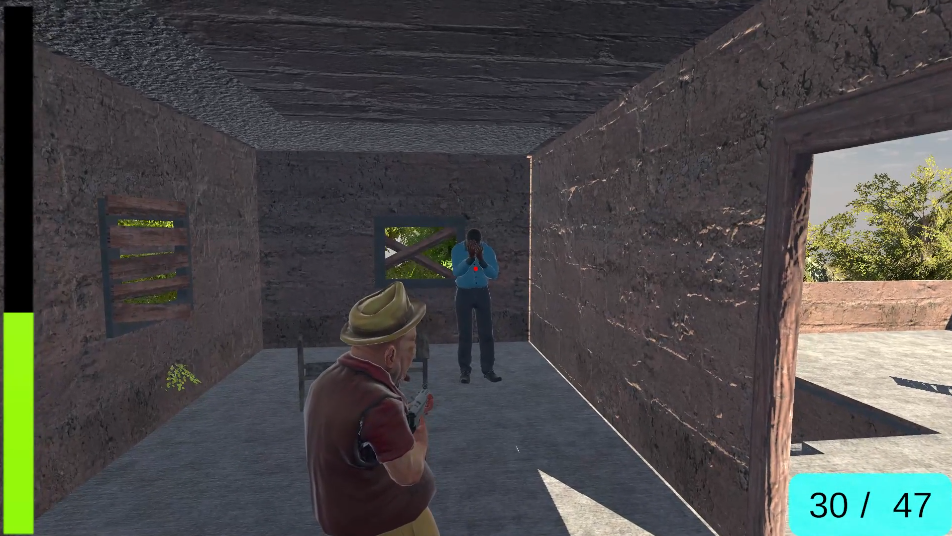

# 🎮 Unity FPS Game Project

This project is a **First Person Shooter (FPS)** prototype developed using the Unity game engine.  
The player fights against enemies, manages ammo, monitors health, and can win or lose the game.  

---

## 🚀 Features
- 🕹️ **Player Control**: Walking, running, strafing, crouching.  
- 🎯 **Shooting System**: Automatic weapon, ammo management, reload system.  
- 🤖 **Enemy AI**:  
  - Patrol system  
  - Suspicion & detection  
  - Shooting at the player  
  - Health & death animation  
- 📜 **Game Management**:  
  - Main menu (play, exit)  
  - Win/Lose screens  
  - Restart and return to main menu  
- 🎨 **Animation System**: Smooth character and weapon animations.  
- 🔊 **Audio & Effects**: Gun sounds, bullet impacts, blood effects.  

---

## 📂 Project Structure

```bash
Assets/
├── Scripts/
│   ├── AnaMenuKontrol.cs      # Main menu control
│   ├── Dusman.cs              # Enemy AI
│   ├── GameManager.cs         # Game manager
│   ├── KarakterKontrol.cs     # Player controller
│   ├── Reloadislem.cs         # Reload animation logic
│   ├── Taramali1.cs           # Weapon system
│   └── BenimKutuphanem/
│       └── Animasyon.cs       # Custom animation library
```

---

## ⚙️ Installation

1. Clone or download this repository:
   ```bash
   git clone https://github.com/username/unity-fps-game.git
   ```
2. Open the project using **Unity Hub**.  
3. Recommended Unity version: **2021.3 LTS or newer**.  
4. Open the **AnaMenu** scene from the `Scenes` folder and press play to run the game.  

---

## 🕹️ Gameplay Controls

- **WASD** → Move  
- **Shift** → Run  
- **Ctrl** → Crouch  
- **Mouse0 (Left Click)** → Shoot  
- **R** → Reload  
- **Reach "OyunSonu" trigger** → Win the game  

---

## 🎥 Gameplay Video

👉 Click the link for a gameplay demonstration:  

(https://drive.google.com/file/d/17maEGtOgEwR833cvPPYtfmVKK7ige4vb/view?usp=drive_link)

---

## 📸 Screenshots

Some screenshots here to showcase the menu, gameplay, and win/lose screens._  

screenshots:  

  

 

   

  

   

---

## 🧪 Testing

- Open the **AnaMenu** scene and click the "Play" button in-game.  
- If the player's health reaches zero → **Game Over Screen** will show.  
- If the player reaches the **end trigger** → **Win Screen** will appear.  

---

## 🤝 Contributing

1. Fork this repository 🍴  
2. Create a new branch:
   ```bash
   git checkout -b feature/new-feature
   ```
3. Commit your changes:
   ```bash
   git commit -m "Added new feature"
   ```
4. Push to the branch:
   ```bash
   git push origin feature/new-feature
   ```
5. Open a Pull Request ✔️  

---

---

## 🙌 Acknowledgements
- Developed with **Unity Engine**  
- Inspired by classic **FPS mechanics**  
- Special thanks to open source Unity community 🎉  
